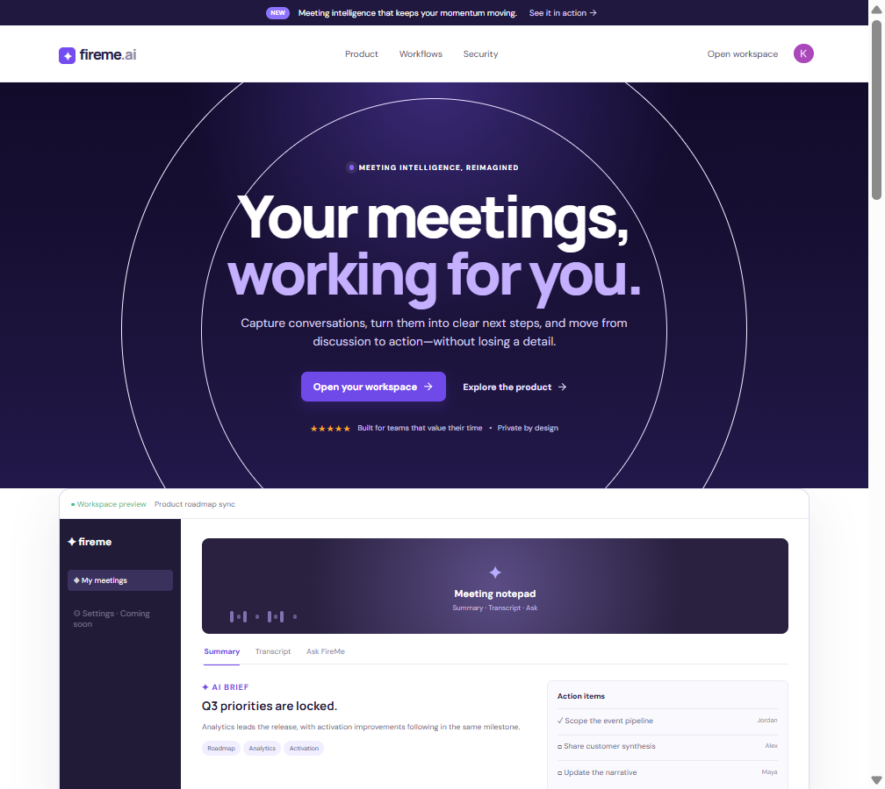
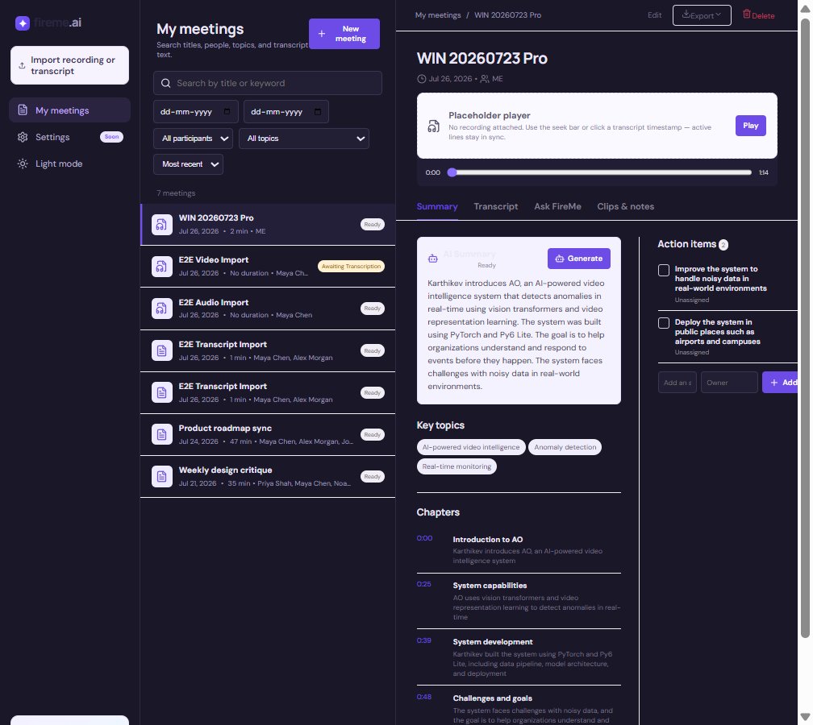
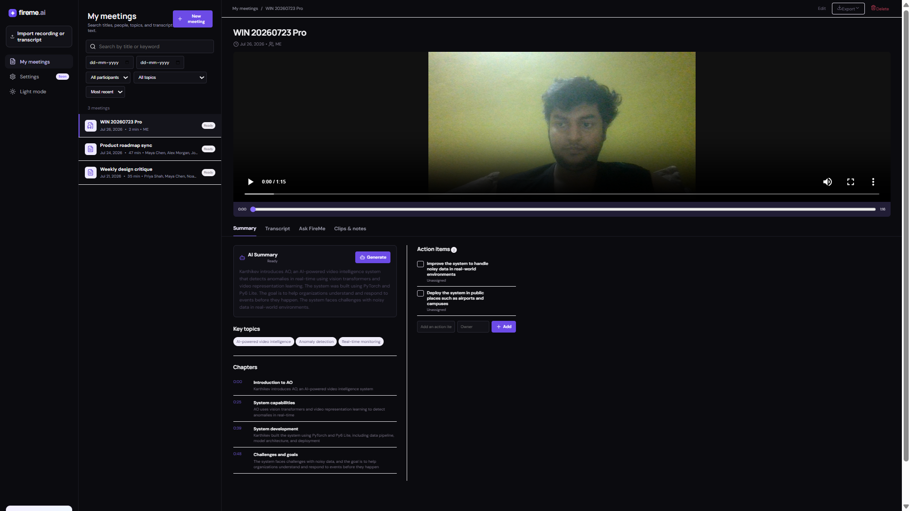
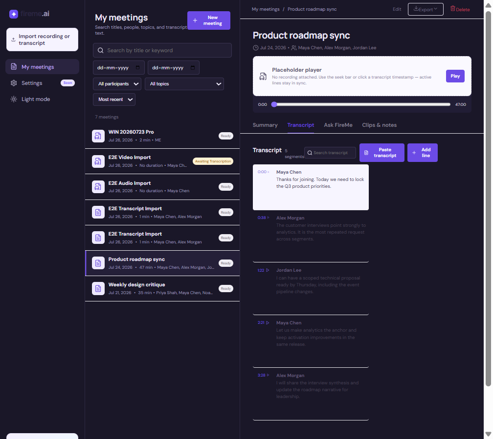
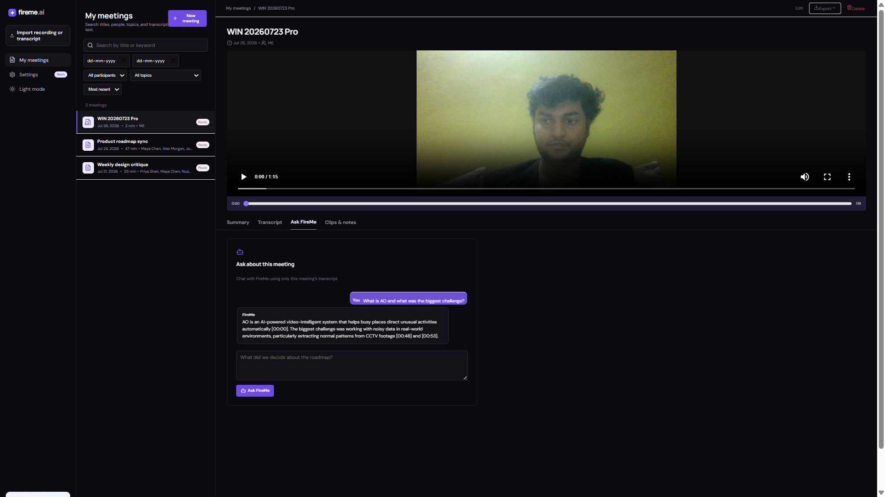
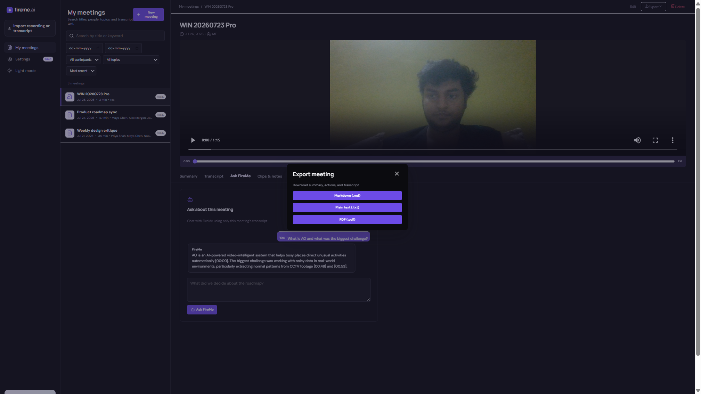

# FireMe — Meeting Notes & Transcription Platform (Fireflies.ai Clone)

Scaler SDE Fullstack Assignment submission.

**Author:** Kartikeya ([@KartikeyaM2007](https://github.com/KartikeyaM2007))

| Deliverable | Link |
| --- | --- |
| **GitHub repository** | https://github.com/KartikeyaM2007/fireme |
| **Hosted demo** | https://fireme-chi.vercel.app |
| **API health** | https://fireme.onrender.com/api/health |

Public repo layout: `frontend/` + `backend/` (as required).

---

## Quick demo path

1. Open https://fireme-chi.vercel.app and sign in with Clerk.
2. On first load, an animated **Render cold-start** card appears (landing + workspace) while the UI warms `/api/health`.
3. Click **Open your workspace** (or **Get Started**).
4. Prefer **Product roadmap sync** (pinned / demo extras) or **WIN 20260723 Pro** (real video).
5. Try **Summary → Talk time → Transcript search → Ask FireMe → Clips → Export**.
6. Optional: open the **Live** sidebar tab → **Browser live capture** (mic) or review Zoom/Meet/Teams Coming soon cards.

### Render free-tier cold start (important for reviewers)

The API is hosted on **Render’s free tier**. Idle dynos sleep, so the **first request after idle can take 30–60 seconds**. This is expected — not a broken deploy.

**What FireMe does about it**

- On **landing** and **workspace** entry, a glass **ColdStartNote** card animates in with copy like *“Waking the API”* / *“API is ready”*.
- It calls `GET /api/health` in the background to wake the dyno early.
- The meetings list shows a **skeleton** instead of a fake empty library while waiting.
- Mid-session slow calls still show a slim status banner if needed.

**Reviewer tip:** open the site once, wait for the note to flip to **API is ready**, then walk the demo. If the card says the API is still waking, wait ~30s and retry — do not score that as a failed feature.

Component: `frontend/components/ColdStartNote.tsx`  
Health check: `https://fireme.onrender.com/api/health`

---

## Screenshots (latest examples)

### 1. Landing — interactive starfield + transparent nav

Dark Fireflies-style hero with canvas starfield (mouse parallax), glass header, dual CTAs, and floating workspace preview.



### 2. Meetings library + video player

Search, filters (participant / topic / date), sort, and a real uploaded recording with seek bar.



### 3. AI summary, topics, chapters, actions

Summary panel with regenerate, key topics, chapter outlines that seek the player, and editable action items.



### 4. Interactive transcript

Timestamped lines, in-transcript search, highlight / comment / soundbite actions, click-to-seek sync with the player.



### 5. Ask FireMe (persisted chat)

LLM Q&A grounded only in this meeting’s transcript, with timestamp citations and a saved thread.



**Example question**

```text
What is AO and what was the biggest challenge?
```

**Example answer (abbreviated)**

```text
AO is an AI-powered video-intelligent system… [00:00].
The biggest challenge was working with noisy data… [00:48] [00:53].
```

### 6. Export

Download the meeting as Markdown, plain text, or PDF.



---

## Example API calls

Base URL (local): `http://127.0.0.1:8000/api`  
Base URL (prod): `https://fireme.onrender.com/api`  
Auth: `Authorization: Bearer <Clerk JWT>` (except health).

### Health

```bash
curl https://fireme.onrender.com/api/health
```

Example response:

```json
{
  "ok": true,
  "database": "ok",
  "ai_configured": true,
  "ai_provider": "groq",
  "storage": "postgres"
}
```

### List meetings (search + filters)

```bash
curl -H "Authorization: Bearer $TOKEN" \
  "https://fireme.onrender.com/api/meetings?query=roadmap&sort=recent"
```

Useful query params: `query`, `participant`, `topic`, `date_from`, `date_to`, `sort=recent|oldest`.

### Ask about a meeting

```bash
curl -X POST -H "Authorization: Bearer $TOKEN" \
  -H "Content-Type: application/json" \
  -d "{\"question\":\"What decisions were made?\"}" \
  "https://fireme.onrender.com/api/meetings/21/ask"
```

### Export Markdown

```bash
curl -H "Authorization: Bearer $TOKEN" \
  "https://fireme.onrender.com/api/meetings/21/export?format=markdown" \
  -o meeting.md
```

Formats: `markdown` | `txt` | `pdf`.

### Stream media (browser player)

HTML `<video>` / `<audio>` cannot send Bearer headers, so the app appends a short-lived token:

```text
GET /api/meetings/{id}/media?access_token=<short-lived-jwt>
```

---

## Tech stack

| Layer | Technology |
| --- | --- |
| **Frontend** | Next.js (TypeScript), React, Clerk UI, canvas starfield |
| **Backend** | Python + FastAPI (Uvicorn) |
| **Database** | SQLite locally; PostgreSQL (Supabase) in production via `DATABASE_URL` |
| **Auth** | Clerk session JWTs verified on the API |
| **AI** | Groq for summaries / Ask / optional media transcription |
| **Hosting** | Frontend → Vercel · Backend → Render · DB → Supabase |

---

## Setup instructions

### Prerequisites

- Node.js 20+
- Python 3.12+
- Clerk keys (for sign-in)
- Groq API key (optional but used for live AI features)
- `ffmpeg` on `PATH` for large media compression before Groq STT (local + Docker image)

### Backend

```powershell
cd backend
Copy-Item .env.example .env
# Fill GROQ_API_KEY, CLERK_ISSUER, CLERK_JWKS_URL, CLERK_AUTHORIZED_PARTIES
python -m venv .venv
.\.venv\Scripts\Activate.ps1
pip install -r requirements.txt
uvicorn main:app --reload --host 127.0.0.1 --port 8000
```

API: http://127.0.0.1:8000 · Docs: http://127.0.0.1:8000/docs

### Frontend

```powershell
cd frontend
Copy-Item .env.example .env.local
# Fill NEXT_PUBLIC_CLERK_PUBLISHABLE_KEY, CLERK_SECRET_KEY
# NEXT_PUBLIC_API_URL=http://127.0.0.1:8000/api
npm install
npx next dev --hostname localhost --port 3000
```

App: http://localhost:3000

Use `localhost` (not `127.0.0.1`) with a Clerk development instance.

### Environment (summary)

**Backend `.env`:** `DATABASE_URL` (optional), `CORS_ORIGINS`, `CLERK_ISSUER`, `CLERK_JWKS_URL`, `CLERK_AUTHORIZED_PARTIES`, `GROQ_API_KEY`, `AI_PROVIDER`, `SEED_DEMO_DATA`, `UPLOAD_DIR`

**Frontend `.env.local`:** `NEXT_PUBLIC_CLERK_PUBLISHABLE_KEY`, `CLERK_SECRET_KEY`, `NEXT_PUBLIC_API_URL`

Do not commit secrets.

### Deployed environment (this submission)

- Frontend: Vercel root `frontend`, `NEXT_PUBLIC_API_URL=https://fireme.onrender.com/api`
- Backend: Render Docker, root `backend`, health `/api/health`
- `CORS_ORIGINS` / `CLERK_AUTHORIZED_PARTIES` include `https://fireme-chi.vercel.app`
- `SEED_DEMO_DATA=false` (per-user starter meetings are provisioned on first login)

---

## Architecture overview

```text
┌─────────────────────────────────────────┐
│  Next.js frontend (TypeScript)          │
│  Landing (Starfield) + Workspace        │
│  Clerk sign-in → Bearer token on APIs   │
└──────────────────┬──────────────────────┘
                   │ REST /api/*
                   ▼
┌─────────────────────────────────────────┐
│  FastAPI backend                        │
│  JWT verify → owner-scoped queries     │
│  Meetings / segments / actions / Ask    │
│  Groq insights + optional STT (ffmpeg) │
└──────────────────┬──────────────────────┘
                   │
        ┌──────────┴──────────┐
        ▼                     ▼
   SQLite / Postgres     Local uploads
   (SQLAlchemy)          (UPLOAD_DIR)
                         + media_blobs
```

**Core UX flow:** Meetings library → open meeting → video/audio + transcript seek sync → AI summary / topics / chapters / actions → Ask / clips / export.

---

## Database schema

Custom schema (evaluated per assignment). Designed around meetings, interactive transcripts, summaries, and action items.

### `meetings`

| Column | Type | Notes |
| --- | --- | --- |
| `id` | Integer PK | |
| `owner_id` | String(128), indexed | Clerk user id; scopes all data |
| `title` | String(200) | |
| `occurred_at` | DateTime | Meeting date |
| `duration_seconds` | Integer | Duration |
| `participants` | Text (JSON array) | Participant names |
| `summary` | Text | AI / seeded summary |
| `topics` | Text (JSON array) | Key topics |
| `chapters` | Text (JSON array) | Outline `{title, start_seconds, summary}` |
| `media_path` | String, nullable | Uploaded recording path |
| `media_type` | String, nullable | MIME type |
| `processing_status` | String | e.g. `ready`, `awaiting_transcription`, `transcription_failed` |
| `processing_error` | Text, nullable | User-visible failure detail |
| `created_at` | DateTime | |

### `transcript_segments`

| Column | Type | Notes |
| --- | --- | --- |
| `id` | Integer PK | |
| `meeting_id` | FK → `meetings.id` | Cascade delete |
| `speaker` | String | Speaker label |
| `start_seconds` | Integer | Timestamp for seek sync |
| `content` | Text | Spoken text |

### `action_items`

| Column | Type | Notes |
| --- | --- | --- |
| `id` | Integer PK | |
| `meeting_id` | FK → `meetings.id` | Cascade delete |
| `text` | Text | Task text |
| `owner` | String | Assignee |
| `completed` | Boolean | Complete toggle |

### `meeting_questions`

| Column | Type | Notes |
| --- | --- | --- |
| `id` | Integer PK | |
| `meeting_id` | FK → `meetings.id` | Cascade delete |
| `question` | Text | Ask FireMe question |
| `answer` | Text | Model answer |
| `created_at` | DateTime | |

### `segment_notes`

| Column | Type | Notes |
| --- | --- | --- |
| `id` | Integer PK | |
| `meeting_id` | FK → `meetings.id` | Cascade delete |
| `segment_id` | FK → `transcript_segments.id`, nullable | |
| `kind` | String | `comment` / `highlight` / `soundbite` |
| `body` | Text | Note text |
| `start_seconds` / `end_seconds` | Integer | Clip range for soundbites |

### `media_blobs`

| Column | Type | Notes |
| --- | --- | --- |
| `key` | String PK | Storage key |
| `content_type` | String, nullable | MIME |
| `data` | LargeBinary | Durable upload bytes |
| `created_at` | DateTime | |

**Relationships:** one `Meeting` has many segments, actions, questions, and notes.  
**Sample data:** each signed-in user is seeded with several meetings that include full transcripts, summaries, topics, chapters, and action items so the app is immediately usable.

---

## API overview

Base path prefix: `/api`  
Auth: `Authorization: Bearer <Clerk JWT>` on all routes except health.

| Method | Endpoint | Purpose |
| --- | --- | --- |
| `GET` | `/api/health` | Health / DB / AI status |
| `GET` | `/api/meetings` | List; `query`, `participant`, `topic`, `date_from`, `date_to`, `sort` |
| `POST` | `/api/meetings` | Create meeting (form) |
| `GET` | `/api/meetings/{id}` | Detail with segments, actions, notes, questions |
| `PUT` | `/api/meetings/{id}` | Edit metadata (title, participants, …) |
| `DELETE` | `/api/meetings/{id}` | Delete meeting |
| `POST` | `/api/meetings/import` | Upload transcript or recording |
| `POST` | `/api/meetings/{id}/paste-transcript` | Paste transcript text |
| `POST` | `/api/meetings/{id}/segments` | Add transcript line |
| `PATCH`/`DELETE` | `/api/segments/{id}` | Edit / delete segment |
| `POST` | `/api/meetings/{id}/actions` | Add action item |
| `PATCH`/`DELETE` | `/api/actions/{id}` | Edit / complete / delete action |
| `POST`/`DELETE` | `/api/meetings/{id}/notes`, `/api/notes/{id}` | Comments / highlights / soundbites |
| `POST` | `/api/meetings/{id}/generate-insights` | AI summary, topics, chapters, actions |
| `POST` | `/api/meetings/{id}/transcribe` | Transcribe uploaded media (background job) |
| `POST` | `/api/meetings/{id}/ask` | Ask a question about this meeting (persisted thread) |
| `GET` | `/api/meetings/{id}/media` | Stream recording (`access_token` for players) |
| `GET` | `/api/meetings/{id}/export` | Export `markdown` / `txt` / `pdf` |

Interactive OpenAPI docs: `/docs`.

---

## Assumptions made

1. **Scope:** Focus is the Fireflies **post-meeting** workspace (library + transcript + summary), not production Zoom/Meet/Teams bots. A **Live** hub offers Coming-soon platform cards plus **browser microphone capture** (Web Speech API) that saves into the same meeting model.
2. **STT:** Assignment marks real speech-to-text as out of scope / placeholder-OK. Seeded transcripts and file upload satisfy the core path; Groq transcription (+ ffmpeg compress under the 25MB limit) is an optional enhancement when media is present.
3. **AI summaries:** May be seeded or LLM-generated from transcript text (both supported).
4. **Auth:** Brief allows assuming a default logged-in user. This submission uses Clerk so the hosted multi-user demo stays private per account.
5. **Media player:** Real `<video>` / `<audio>` when a file exists; otherwise a seek bar stays synced with transcript timestamps.
6. **Placeholders:** Live bot, calendar/CRM integrations, and team sharing are exposed as **Settings → Coming soon**.
7. **Database:** Assignment asks for SQLite schema design; SQLite works locally. Production uses the same schema on PostgreSQL through `DATABASE_URL`.
8. **JSON columns:** `participants`, `topics`, and `chapters` are stored as JSON text for portable schema across SQLite and Postgres.
9. **Cold starts:** Render free-tier dynos sleep when idle. FireMe shows an animated **ColdStartNote** on landing + workspace entry, warms `/api/health`, and uses a skeleton list so a slow wake does not look like an empty product.
10. **Media streaming:** Playback uses a short-lived `access_token` query parameter because HTML media elements cannot send Authorization headers.

---

## Core features implemented (Must Have)

1. **Meetings library / dashboard** — list with title, date, duration, participants; search; filter by date/participant/topic; sort by recency; profile + Settings placeholder  
2. **Meeting / transcript detail** — speaker labels, timestamps, seek bar / video player, click-to-seek both ways, in-transcript search with highlights  
3. **AI summary & notes** — summary, action items, topics, chapters  
4. **CRUD** — create (form / upload / paste), edit metadata, delete, add/edit/complete actions; all persist  
5. **Fireflies experience** — interactive landing starfield, library + detail layout, transcript/summary panels, forms/modals/search/filters, toasts, Settings placeholder  

### Bonus features included

- Export PDF / Markdown / TXT  
- Global search across meetings (including transcript text)  
- Topics on meetings **with dedicated topic filter**  
- LLM “Ask FireMe” **persisted chat history** about a meeting  
- Comments / highlights / **playable soundbites** on transcript segments  
- Dark mode toggle  
- Durable media storage (Postgres `media_blobs`)  
- Background transcription jobs (non-blocking HTTP) + ffmpeg pre-compress  
- Interactive canvas starfield + transparent scrolled header on the marketing page  
- Animated **Render cold-start note** (`ColdStartNote`) on site entry + library skeleton while waking  
- Talk-time bars, pin/share, timestamp deep links, Speaker N labels after STT  
- **Live hub** — Zoom/Meet/Teams + calendar Coming soon, plus **browser mic live capture** that saves a meeting  

---

## Project structure

```text
fireme/
  frontend/
    app/                 Next.js entry (page, layout, styles)
    components/          Landing, Starfield, ColdStartNote, LiveHub, Workspace
    lib/                 API client, types, format helpers
  backend/
    main.py              FastAPI app + routes
    auth.py / schemas.py / serialize.py / seed.py / exports.py
    storage.py           Durable uploads (Postgres / Supabase)
    jobs.py              Background transcription
    models.py / services.py
  docs/screenshots/      README demo images (latest)
  README.md
```

## Author

**Kartikeya** — Scaler SDE Fullstack Assignment · FireMe (Fireflies.ai clone)

- GitHub: https://github.com/KartikeyaM2007  
- Repo: https://github.com/KartikeyaM2007/fireme  

## Original work

This repository is an original implementation for the Scaler assignment. It is not a fork of an existing Fireflies clone and is not affiliated with Fireflies.ai.
